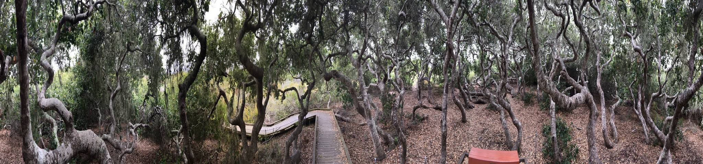

## Spherical Structure-from-Motion

Code for our papers:

Baker, L., S. Mills, S. Zollmann, and J. Ventura, "CasualStereo: Casual Capture of Stereo Panoramas with Spherical Structure-from-Motion", IEEE Conference on Virtual Reality and 3D User Interfaces (VR), 2020.

Ventura, J., "Structure from Motion on a Sphere", European Conference on Computer Vision (ECCV), 2016.

### Dependencies

* OpenCV 3+
* Ceres solver
* Eigen 3+
* [Polynomial](https://github.com/jonathanventura/polynomial)
* CUDA (for stereo panorama stitcher)

### Building

    mkdir build ;
    cd build ;
    cmake .. ;
    make -j8 ;
    
The panorama stitcher app is disabled by default, since it requires CUDA which may not be available on all machines.  To enable it:

    mkdir build ;
    cd build ;
    cmake .. -DBUILD_STITCHER=TRUE ;
    make -j8 ;
    
### Usage

If your images have radial distortion, first undistort them using:

    undistort_images -intrinsics <path to intrinsics with distortion> -intrinsicsout <path for output intrinsics file> -video <path to video> -output <path ot folder for undistorted images> -rotate <rotation>
    
The "rotate" parameter is the number of clockwise 90 degree rotations to apply (useful for iPhone videos, for example).

To run the spherical structure-from-motion pipeline:

    run_spherical_sfm -intrinsics <path to intrinsics> -video <path to video> -output <path to output>

The video path can be an image filename specifier such as %06d.png.  The intrinsics file should contain the focal length, center x, and center y separated by spaces.

To make the stereo panoramas:

    make_stereo_panorama -intrinsics <path to intrinsics> -video <path to video> -output <path to output>

### Capture tips

* Hold the camera in an outstretched hand and turn in a roughly level and complete circle (close the loop).  Don't go too far over the loop closure point (no more than 30 degrees beyond the starting point).

### Examples

You can view these example panoramas in a WebVR-compatible browser or headset.

* [Elfin Forest](webviewer/index.html?name=elfinforest)
* [Children's Garden](webviewer/index.html?name=childrensgarden)
* [Pismo Beach](webviewer/index.html?name=pismo)
* [Owheo Courtyard](webviewer/index.html?name=owheo)
* [Street](webviewer/index.html?name=street)

